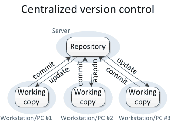
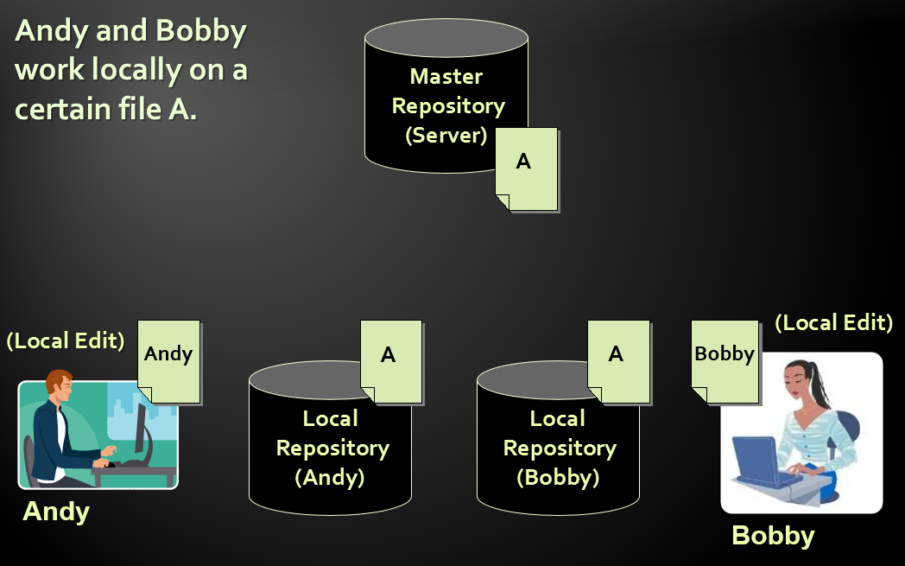

<!-- section start -->
<!-- attr: { class:'slide-title', showInPresentation:true, hasScriptWrapper:true, style:'font-size: 42px' } -->
# Source Control Systems
## Using source contol systems in practice

<!-- section start -->
<!-- attr: { showInPresentation:true, hasScriptWrapper:true, style:'font-size: 42px' } -->
# Table of Contents
- Software Configuration Management (SCM)
- Version Control Systems: Philosophy
- Versioning Models
  - Lock-Modify-Unlock
  - Copy-Modify-Merge
  - Distributed Version Control
- Tags and Branching
- Popular Source Control Systems
- Git crash course
- Project Hosting Sites
- Practice: Using GitHub

<!-- attr: { showInPresentation:true, hasScriptWrapper:true, style:'font-size: 42px' } -->
<!-- # Software Configuration Management -->
- **Version Control** ≈ **Software Configuration Management (SCM)**
  - A software engineering discipline
  - Consists of techniques, practices and tools for working on shared source code and files
  - Mechanisms for management, control and tracking the changes
  - Defines the process of change management
  - Keeps track of what is happening in the project
  - Solves conflicts in the changes

<!-- attr: { showInPresentation:true, hasScriptWrapper:true, style:'font-size: 42px' } -->
# SCM and the Software Development Lifecycle

<!-- section start -->
<!-- attr: { class:'slide-section', showInPresentation:true, hasScriptWrapper:true, style:'font-size: 42px' } -->
# Version Control
## Managing Different Version ofthe Same File / Document

<!-- attr: { showInPresentation:true, hasScriptWrapper:true, style:'font-size: 42px' } -->
<!-- # Version Control Systems -->
- Functionality
  - File versions control
  - Merge and differences search
  - Branching
  - File locking
  - Console and GUI clients
- Well known products
  - CVS, Subversion (SVN) – free, open source
  - Git, Mercurial – distributed, free, open source
  - Perforce, Microsoft TFS – free

<!-- attr: { showInPresentation:true, hasScriptWrapper:true, style:'font-size: 42px' } -->
# Version Control
- **Constantly used** in software engineering
  - During the software development
  - While working with documents
- Changes are identified with an increment of the **version number**
  - for example 1.0, 2.0, 2.17
- Version numbers are historically linked with the person who created them
  - **Full change logs** are kept

<!-- attr: { showInPresentation:true, hasScriptWrapper:true, style:'font-size: 42px' } -->
# Change Log
- Version control systems keep a complete **change log (history)**
  - The date and hour of every change
  - The user who made the change
  - The files changed + old and new version
- **Old versions can be retrieved**, examined and compared 
- It is possible to **return to an old version** (revert)

<!-- section start -->
<!-- attr: { class:'slide-section', showInPresentation:true, hasScriptWrapper:true, style:'font-size: 42px' } -->
# Source Control Vocabulary
## Key terminology

<!-- attr: { showInPresentation:true, hasScriptWrapper:true, style:'font-size: 42px' } -->
<!-- # Vocabulary -->
- **Repository** (source control repository)
  - A server that stores the files (documents)
  - Keeps a change log
- **Revision**, **Version**
  - Individual version (state) of a document that is a result of multiple changes
- **Check-Out**, **Clone**
  - Retrieves a working copy of the files from a remote repository into a local directory
  - It is possible to lock the files

<!-- attr: { showInPresentation:true, hasScriptWrapper:true, style:'font-size: 42px' } -->
<!-- # Vocabulary -->
- **Change**
  - A modification to a local file (document) that is under version control
- **ChangeSet**, **Change List**
  - A set of changes to multiple files that are going to be committed at the same time
- **Commit**, **Check-In**
  - Submits the changes made from the local working copy to the repository
  - Automatically creates a new version
  - Conflicts may occur!

<!-- attr: { showInPresentation:true, hasScriptWrapper:true, style:'font-size: 42px' } -->
<!-- # Vocabulary -->
- **Conflict**
  - The simultaneous change to a certain file by multiple users
  - Can be solved automatically and manually
- **Update**, **Get Latest Version**, **Fetch** / **Pull**
  - Download the latest version of the files from the repository to a local working directory
- **UndoCheck-Out**, **Revert**/ **Undo Changes**
  - Cancels the local changes
  - Restores their state from the repository

<!-- attr: { showInPresentation:true, hasScriptWrapper:true, style:'font-size: 42px' } -->
<!-- # Vocabulary -->
- **Merge**
  - Combines the changes to a file changed locally and simultaneously in the repository 
  - Can be automated in most cases
- **Label**, **Tag**
  - Labels mark with a name a group of files in a given version
  - For example a release
- **Branching**
  - Division of the repositories in a number of separate work flows

<!-- section start -->
<!-- attr: { class:'slide-section', showInPresentation:true, hasScriptWrapper:true, style:'font-size: 42px' } -->
# Versioning Models
## Lock-Modify-Unlock, Copy-Modify-Merge, Distributed Version Control

<!-- attr: { showInPresentation:true, hasScriptWrapper:true, style:'font-size: 42px' } -->
# Centralized Version Control

<!-- attr: { showInPresentation:true, hasScriptWrapper:true, style:'font-size: 42px' } -->
# Distributed Version Control

<!-- attr: { showInPresentation:true, hasScriptWrapper:true, style:'font-size: 42px' } -->
# Versioning Models
- **Lock-Modify-Unlock**
  - Only one user works on a given file at a time
    - **No conflicts** occur
    - Users **wait** each other for the locked files &rarr; works for **small development teams** only
    - Pessimistic concurrency control
  - _Examples_:
    - Visual SourceSafe (old fashioned)
    - TFS, SVN, Git (with exclusive locking)
  - Lock-modify-unlock is rarely used

<!-- attr: { showInPresentation:true, hasScriptWrapper:true, style:'font-size: 42px' } -->
<!-- # Versioning Models -->
- **Copy-Modify-Merge**
  - Users make parallel changes to their own working copies
  - **Conflicts** are possible when multiple user edit the same file
    - Conflicting changes are **merged** and the final version emerges (automatic and manual merge)
  - Optimistic concurrency control
  - _Examples_:
    - SVN, TFS, Git

<!-- attr: { showInPresentation:true, hasScriptWrapper:true, style:'font-size: 42px' } -->
<!-- # Versioning Models -->
- **Distributed Version Control**
  - Users work in their own repository
    - Using the Lock-Modify-Unlock model
    - Local changes are **locally committed**
    - No concurrency, no local conflicts
  - From time to time, the local repository is **pushed** to the central repository
    - **Conflicts** are possible and **merges** often occur
  - _Example_ of distributed version control systems:
    - Git, Mercurial

<!-- attr: { showInPresentation:true, hasScriptWrapper:true, style:'font-size: 42px' } -->
# Problems with Locking 
- Administrative problems:
  - Someone locks a given file and forgets about it
  - **Time is lost** while waiting for someone to release a file &rarr; works in **small teams only**
- **Unneeded locking** of the whole file
  - Different changes are not necessary in conflict
  - _Example_ of **non-conflicting changes**:
    - Andy works at the begging of the file
    - Bobby works at the end of the file

<!-- attr: { showInPresentation:true, hasScriptWrapper:true, style:'font-size: 42px' } -->
# Merging Problems
- If a given file is concurrently modified, it is necessary to **merge the changes**
  - Merging is hard!
    - It is not always possible to do it automatically
- Responsibility and coordination between the developers is required
  - Commit changes as early as finished
  - Do not commit code that does not compile or blocks the work of the others
  - Leave comments at each commit

<!-- attr: { showInPresentation:true, hasScriptWrapper:true, style:'font-size: 42px' } -->
# File Comparison / Merge Tools
- During manual merge use file comparison
- There are visual comparison / merge tools:
  - TortoiseMerge
  - WinDiff
  - AraxisMerge
  - WinMerge
  - BeyondCompare
  - CompareIt
  - …

<!-- attr: { showInPresentation:true, hasScriptWrapper:true, style:'font-size: 42px' } -->
# File Comparison – _Example_

<!-- section start -->
<!-- attr: { class:'slide-section', showInPresentation:true, hasScriptWrapper:true, style:'font-size: 42px' } -->
# The"Lock-Modify-Unlock" Model

<!-- attr: { showInPresentation:true, hasScriptWrapper:true, style:'font-size: 42px' } -->
<!-- # The Lock-Modify-Unlock Model -->

<!-- attr: { showInPresentation:true, hasScriptWrapper:true, style:'font-size: 42px' } -->
<!-- # The Lock-Modify-Unlock Model -->

<!-- attr: { showInPresentation:true, hasScriptWrapper:true, style:'font-size: 42px' } -->
<!-- # The Lock-Modify-Unlock Model -->

<!-- attr: { showInPresentation:true, hasScriptWrapper:true, style:'font-size: 42px' } -->
<!-- # The Lock-Modify-Unlock Model -->

<!-- attr: { showInPresentation:true, hasScriptWrapper:true, style:'font-size: 42px' } -->
<!-- # The Lock-Modify-Unlock Model -->

<!-- attr: { showInPresentation:true, hasScriptWrapper:true, style:'font-size: 42px' } -->
<!-- # The Lock-Modify-Unlock Model -->

<!-- attr: { showInPresentation:true, hasScriptWrapper:true, style:'font-size: 42px' } -->
<!-- # The Lock-Modify-Unlock Model -->

<!-- section start -->
<!-- attr: { class:'slide-section', showInPresentation:true, hasScriptWrapper:true, style:'font-size: 42px' } -->
# The "Copy-Modify-Merge" Model

<!-- attr: { showInPresentation:true, hasScriptWrapper:true, style:'font-size: 42px' } -->
<!-- # The Copy-Modify-Merge Model -->

<!-- attr: { showInPresentation:true, hasScriptWrapper:true, style:'font-size: 42px' } -->
<!-- # The Copy-Modify-Merge Model -->

<!-- attr: { showInPresentation:true, hasScriptWrapper:true, style:'font-size: 42px' } -->
<!-- # The Copy-Modify-Merge Model -->

<!-- attr: { showInPresentation:true, hasScriptWrapper:true, style:'font-size: 42px' } -->
<!-- # The Copy-Modify-Merge Model -->

<!-- attr: { showInPresentation:true, hasScriptWrapper:true, style:'font-size: 42px' } -->
<!-- # The Copy-Modify-Merge Model -->

<!-- attr: { showInPresentation:true, hasScriptWrapper:true, style:'font-size: 42px' } -->
<!-- # The Copy-Modify-Merge Model -->

<!-- attr: { showInPresentation:true, hasScriptWrapper:true, style:'font-size: 42px' } -->
<!-- # The Copy-Modify-Merge Model -->

<!-- section start -->
<!-- attr: { class:'slide-section', showInPresentation:true, hasScriptWrapper:true, style:'font-size: 40px' } -->
# The "Distributed Version Control" Versioning Model

<!-- attr: { showInPresentation:true, hasScriptWrapper:true, style:'font-size: 42px' } -->
<!-- # Distributed Version Control -->

<!-- attr: { showInPresentation:true, hasScriptWrapper:true, style:'font-size: 42px' } -->
<!-- # Distributed Version Control -->

<!-- attr: { showInPresentation:true, hasScriptWrapper:true, style:'font-size: 42px' } -->
<!-- # Distributed Version Control -->

<!-- attr: { showInPresentation:true, hasScriptWrapper:true, style:'font-size: 42px' } -->
<!-- # Distributed Version Control -->

<!-- attr: { showInPresentation:true, hasScriptWrapper:true, style:'font-size: 42px' } -->
<!-- # Distributed Version Control -->

<!-- attr: { showInPresentation:true, hasScriptWrapper:true, style:'font-size: 42px' } -->
<!-- # Distributed Version Control -->

<!-- attr: { showInPresentation:true, hasScriptWrapper:true, style:'font-size: 42px' } -->
<!-- # Distributed Version Control -->

<!-- attr: { showInPresentation:true, hasScriptWrapper:true, style:'font-size: 42px' } -->
<!-- # Distributed Version Control -->

<!-- section start -->
<!-- attr: { class:'slide-section', showInPresentation:true, hasScriptWrapper:true, style:'font-size: 42px' } -->
# Tags and Branches

<!-- attr: { showInPresentation:true, hasScriptWrapper:true, style:'font-size: 42px' } -->
# Tags

<!-- attr: { showInPresentation:true, hasScriptWrapper:true, style:'font-size: 42px' } -->
# Branching
- **Branching** allows a group of changes to be separated in a development line
  - Different developers work in different branches
- Branching is suitable for:
  - Development of **new feature or fix** in a new version of the product (for example version 2.0)
    - Features are invisible in the main development line until merged with it
  - You can still make changes in the older version (for example version 1.0.1)

<!-- attr: { showInPresentation:true, hasScriptWrapper:true, style:'font-size: 42px' } -->
# Merging Branches
- Some companies work in separate branches
  - For each new feature / fix / task
- Once a feature / fix / task is completed
  - It is **tested locally** and **committed** in its branch
- Finally it should be **merged** into the main development line
  - Merging is done locally
  - Conflicts are resolved locally
  - If the merge is tested and works well, it is **integrated** back in the main development line

<!-- attr: { showInPresentation:true, hasScriptWrapper:true, style:'font-size: 42px' } -->
# Branching – _Example_

<!-- attr: { showInPresentation:true, hasScriptWrapper:true, style:'font-size: 42px' } -->
# Merging Branches – _Example_

<!-- section start -->
<!-- attr: { class:'slide-section', showInPresentation:true, hasScriptWrapper:true, style:'font-size: 42px' } -->
<!-- # Popular Source Control Systems -->

<!-- attr: { showInPresentation:true, hasScriptWrapper:true, style:'font-size: 42px' } -->
# Subversion (SVN)
- **Subversion (SVN)**
  - **Open source** SCM repository
  - http://subversion.tigris.org
  - Runs on UNIX, Linux, Windows
- Console client
  - **svn**
- GUI client
  - **TortoiseSVN** – http://tortoisesvn.tigris.org
- Visual Studio / Eclipse plug-ins

<!-- attr: { showInPresentation:true, hasScriptWrapper:true, style:'font-size: 42px' } -->
# Team Foundation Server
- **Team FoundationServer (TFS)**
  - SCM repository **from Microsoft**
  - Integrated source control, team collaboration and project tracking system
  - Deep **integration with Visual Studio**
- **Team Explorer**
  - **TFS client** – free download from Microsoft
  - Fully integrated into Visual Studio
    - Part of VS 2012, additional download in VS 2010

<!-- attr: { showInPresentation:true, hasScriptWrapper:true, style:'font-size: 42px' } -->
# Mercurial
- **Mercurial**
  - **Cross-platform**, written in Python
  - **Free software** under GNU GPL v2
  - Uses **Distributed Version Control** model
- Clients:
  - **[Sourcetree](http://www.sourcetreeapp.com/)**
  - **[TourtoiseHg](http://tortoisehg.bitbucket.org/)**

<!-- attr: { showInPresentation:true, hasScriptWrapper:true, style:'font-size: 42px' } -->
# Git
- **Git**
  - **Distributed** source-control system
  - Work with **local** and **remote** repositories
  - **Git bash** – command line interface for Git
  - **Free, open-source**
  - Has Windows version (**msysGit**)
    - http://msysgit.github.com
  - Clients
    - Git Bash for Windows
    - [TortoiseGit](https://tortoisegit.org/)
    - [More clients](https://git-scm.com/downloads/guis)

<!-- section start -->
<!-- attr: { class:'slide-section', showInPresentation:true, hasScriptWrapper:true, style:'font-size: 42px' } -->
# Git Crash Course

<!-- attr: { showInPresentation:true, hasScriptWrapper:true, style:'font-size: 42px' } -->
<!-- # Git Crash Course -->
- **msysGit** installation (for Windows) 
  - “Next, Next, Next” does the trick
  - Options to select (they should be selected by default)
    - “Use Git Bash only”
    - “Checkout Windows-style, commit Unix-style endings”
    - _Note_: this concerns only beginners

<!-- attr: { showInPresentation:true, hasScriptWrapper:true, style:'font-size: 42px' } -->
<!-- # Git Crash Course -->
- Using **Git Bash**
  - Standard **command prompt** with added features
  - Creating a local repository
    - **git init**
  - Preparing (adding/choosing) files for a commit
    - **git add [filename]** ("git add ." adds everything)
  - Committing to a local repository
    - **git commit –m "[your message here]"**

<!-- attr: { showInPresentation:true, hasScriptWrapper:true, style:'font-size: 42px' } -->
<!-- # Git Crash Course
- Using **Git Bash** -->
  - Git “remote”– name for a repository URL
  - Git “master” – the current local branch (think of it as “where you have committed”)
  - Creating a remote
    - **git add remote [remote name] [remote url]**
  - Pushing to a remote (sending to a remote repository)
    - **git push [remote name] master**

<!-- attr: { class:'slide-section demo', showInPresentation:true, hasScriptWrapper:true, style:'font-size: 42px' } -->
<!-- # Using Git Bash -->
## Demo

<!-- section start -->
<!-- attr: { class:'slide-section', showInPresentation:true, hasScriptWrapper:true, style:'font-size: 42px' } -->
# Project Hosting and Team Collaboration Sites
## SourceForge, Google Code, CodePlex, Project Locker

<!-- attr: { showInPresentation:true, hasScriptWrapper:true, style:'font-size: 42px' } -->
# Project Hosting Sites
- GitHub – https://github.com
  - The #1 project hosting site in the world
  - Free for open-source projects
  - Has paid plans for private projects
- Can be used with TortoiseGit, Git Bash, Windows GUI and other

<!-- attr: { showInPresentation:true, hasScriptWrapper:true, style:'font-size: 42px' } -->
# Project Hosting Sites
- SourceForge – http://www.sourceforge.net
  - Source control (SVN, Git, …), web hosting, tracker, wiki, blog, mailing lists, file release, statistics, etc.
  - Free, all projects are public and open source
- BitBucket - https://bitbucket.org
  - Uses Git or Mercurial
  - Both free and commercial accounts
  - Similar to GitHub

<!-- attr: { showInPresentation:true, hasScriptWrapper:true, style:'font-size: 42px' } -->
<!-- # Project Hosting Sites -->
- CodePlex – http://www.codeplex.com
  - Microsoft's open source projects site
  - Team Foundation Server (TFS) infrastructure
  - Source control (TFS), issue tracker, downloads, discussions, wiki, etc.
  - Free, all projects are public and open source
- Project Locker – http://www.projectlocker.com
    - Source control (SVN), TRAC, CI system, wiki, etc.
    - Private projects (not open source)
    - Free and paid editions

<!-- attr: { showInPresentation:true, hasScriptWrapper:true, style:'font-size: 42px' } -->
<!-- # Project Hosting Sites -->
- Assembla – http://www.assembla.com
  - Source control (SVN, Git), issue tracker, wiki, chats, files, messages, time tracking, etc.
  - Private / public projects, free and paid editions
- Bitbucket – http://bitbucket.org
  - Source control (Mercurial), issue tracker, wiki, management tools
  - Private projects, free and paid editions
- Others: Unfuddle, XP-Dev, Beanstalk

<!-- attr: { showInPresentation:true, hasScriptWrapper:true, style:'font-size: 42px' } -->
<!-- # Project Hosting Sites -->
- GitLab - https://about.gitlab.com
  - Uses Git
  - Community and Enterprise editions

<!-- attr: { class:'slide-section demo', showInPresentation:true, hasScriptWrapper:true, style:'font-size: 42px' } -->
# GitHub - Let's get going
## Demo

<!-- start section -->
<!-- attr: { class:'slide-section questions', showInPresentation:true, hasScriptWrapper:true, style:'font-size: 42px' } -->
<!-- # Software Configuration Management 
## Questions? -->
